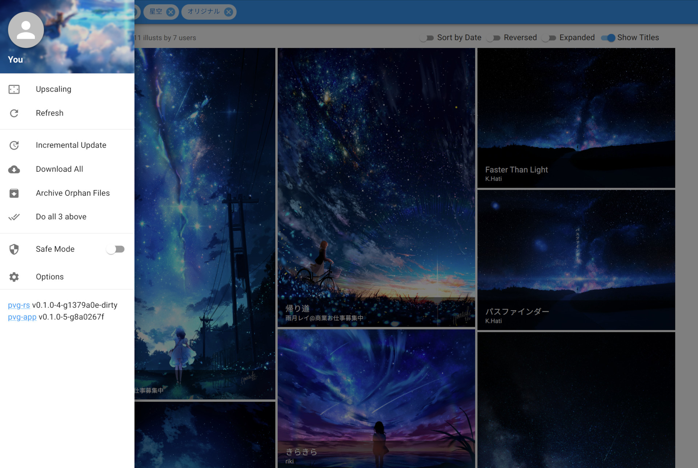

# pvg-rs

[](https://github.com/karin0/pvg-rs/actions/workflows/build.yml)

Explore, filter, and download artworks from your [pixiv](https://www.pixiv.net/) bookmarks.

## Features

- Sync with your pixiv bookmarks incrementally
- Find or exclude bookmarked artworks by tags, title, or author
- Parallel and reliable download of bookmarked artworks
- Local and remote access via a responsive [Web UI](https://github.com/karin0/pvg-app)
- Cross-platform (Windows, Linux, and Android via [Termux](https://termux.com/) are tested)

## Highlights

- Custom [FTS engine](pvg/src/search) with FM-Index and incremental LSM for instant multi-keyword querying
  - Suffix-based indexing for accurate substring search in CJK titles and tags
  - Optimized with square-root decomposed bitmaps and query planner to achieve <1ms latency on 100K+ collections
- Robust and efficient download manager with asynchronous I/O and file transactions for data integrity
- Minimal resource usage for local-first experience on resource-constrained devices

## Screenshot



## Getting Started

- Download and extract the latest [Release](https://github.com/karin0/pvg-rs/releases) for your platform
- Retrieve your pixiv `refresh_token`
  - See [Retrieving Auth Token](https://gist.github.com/ZipFile/c9ebedb224406f4f11845ab700124362) or use [get-pixivpy-token](https://github.com/eggplants/get-pixivpy-token)
- Create a `config.json` file in the extracted directory
  - A minimal example:
    ```json
    {
      "username": "<your pixiv username>",
      "refresh_token": "<your refresh token>"
    }
    ```
- Run `pvg` or `pvg.exe` to start the server
- Open the URL shown in the terminal (Ctrl-click) in your browser
  - Typically http://127.0.0.1:5678

## Configuration

The following options can be specified in `config.json`:

- `username`: Your pixiv username (required)
- `refresh_token`: Your pixiv refresh token (required)
- `port`: Port to listen on (default: `5678`)
- `host`: Interface to listen on (default: `"127.0.0.1"`)
  - Specify a LAN address or `"0.0.0.0"` to allow access from network
- `proxy`: Proxy to use for network requests
  - Example: `"http://127.0.0.1:8080"`
- `safe_mode`: Turn on to show only illustions with a safe sanity_level (default: `false`)
- `home`: Path to the directory to store data and index (default: `.`)
  - Downloaded artworks are saved in `<home>/pix`

## Build

```console
$ cargo build --release
```

## Credits

The usage of pixiv AAPI refers to the following projects:

- [pixivpy](https://github.com/upbit/pixivpy)
- [pixivpy-async](https://github.com/Mikubill/pixivpy-async)
